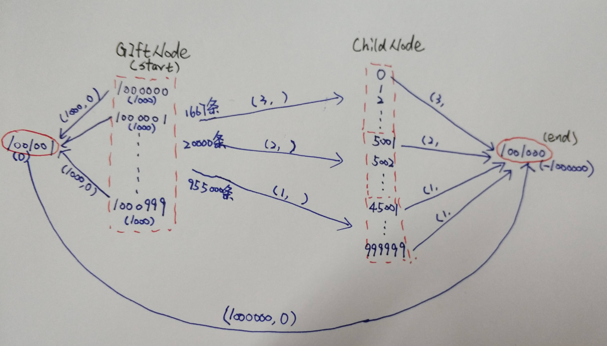

- 说明：本文是对这个比赛第三名证明方案的理解，参考了第三名提交的证明和代码

## 图结构

## 方案流程

- 来自薛乔的流程

1. 为每个孩子构建prefer_dict, {gift_id,[a,b]}，a是child_prefer，b是gift_perfer
2. 设置权重，w_child=9020和w_gift=2（计算cost用），画图，设置supply，用min-cost-flow_1得到分配结果1；
3. 从2中得到分配结果里有不符合三胞胎双胞胎要求的，以及还有剩余的礼物没有分配。重新加大权重w_child=90200000和w_gift=20000，画图，设supply，注意礼物节点的supply有所变动，用min-cost-flow_2计算得到剩余礼物的分配结果，并与分配结果1进行合并得到最终的分配结果2；
4. 分配结果2中仍然有不符合要求的分配，以及剩余的礼物，更改权重w_child=10000和w_gift=1，这里权重虽然变小了，但是cost的计算方式有了改变，用min-cost-flow_2计算分配结果，与分配结果2进行合并得到分配结果3。结果3中只剩下一对双胞胎不满足要求了，就是[34267,34268]，hoge2_3的notebook中对这对双胞胎的试了所有的可能分配，发现在给他们207时，最终的满意度是最高的，所以手动给他们分配207；
5. 这时候，还有剩余的礼物，已有的分配结果中双胞胎三胞胎都以满足要求，所以现在画图只考虑独生子女的点，用min-cost-flow_34267只对独生子女做分配，结果与分配结果3合并得到结果4；
6. 此时，仍有剩余的礼物，和未分配到的三胞胎，双胞胎，设置好每种礼物分配给双胞胎和三胞胎的量，手动一一分配，得到的结果与结果4合并，得到最后的分配结果

- **下面的流程是否存在问题，请修改**
- (9020,2),(63,2),(44869),958818
- 保留已经匹配好的双胞胎和三胞胎,将剩余礼物匹配对剩下的人
- (90200000,20000),(11,2),(44973)
- 保留已经匹配好的双胞胎和三胞胎,将剩余礼物匹配对剩下的人
- (10000,1),(1,0)
- 手动设置不满足双胞胎的配对情况,将剩余礼物匹配对剩下的人
- (10000,1),(8,8)
- 将不满足情况的双胞胎的礼物设为剩余礼物，继续匹配

## 符号标识

- M：满足题目要求的所有匹配集合（即三胞胎和双胞胎拥有相同礼物）
- M'：所有可能的匹配集合
- 明显地，M是M'的子集
- CH(m)：m匹配方案下所有childID的6 * ChildHappiness的和
- SH(m)：m匹配方案下所有giftID的6 * GiftHappiness的和
- 其中m属于M'，这里乘以6是为了让这里的值都是整数
- 目标为寻找最大化S(m)的m，其中m属于M，S(m)={10 * CH(m)}^3+{SH(m)}^3，推导见下图：

- 作者证明了最大可能的happiness为0.936301547258160369437137474，在CH(m)=1173959622,SH(m)=1703388时取到最大值

## 证明流程

通过以下步骤证明了最终可能的最大happiness为0.936301547258160369437137474.

### 第一步，step1.ipynb

- 对所有可能的匹配m属于M'，使用最小损失流算法得到CH(m)的最大值为1173959626
- 由于M为M'的子集，对于所有满足题目要求的匹配m属于M，CH(m)<=1173959626
- 又由于满足题目要求匹配的CH(m)一定是6的倍数，1173959626对6取余得4，所以CH(m)<=1173959622

### 第二步，step2.ipynb

- 经过改变CH和SH的权重，我们发现很难满足双胞胎[34267,34268]的礼物要求

|W_child|W_gift|CH|SH|ANH|len(twins_differ)|len(triplets_differ)|len(well_assigned)|sum(Gifts_left)|comment|
|-|-|-|-|-|-|-|-|-|-|
|9020|2|1173959622|1709307|0.9363015472581903|63|2|44869|958818||
|90200000|20000|1173959622|1709307|0.9363015472581903|11|2|44973|||
|10000|1|1173959622|1709307|0.9363015472581903|1|0|-|-|[34267,34268],[207,494]|
|10000|1|1173959622|1703388|0.9363015472581603|0|0|-|-||

- 令M'j属于M'，其中j为礼物编号，取值为0-999，表示将礼物j给双胞胎[34267,34268]的匹配集合
- 在[34267,34268]不满足情况下，最大化CH(m)，得到CH(m)的最大值为1173959620
- 那么在[34267,34268]满足的情况下，CH(m)可能的最大值为1173959632
- 通过遍历[34267]的偏好列表，计算将礼物j给[34267]情况下的CH(m)值，得到满足CH(m)>=1173959620的礼物j
- 结果是：当且仅当j=207时，CH(m)>=1173959620,取值为1173959626

### 第三步，step3.ipynb

- 在CH(m)=1173959622的情况下，最大化SH(m)
- 搜索M'j的匹配集，其中j=207
- 最大化10000 * CH(m) + SH(m)，解决一个min-cost max-flow问题，得到SH(m)最大值为1703388

### 第四步，step4.ipynb

- 上面已经证明了对于所有满足要求的匹配，CH(m)最大值为1173959622，在CH(m)取最大值的情况下，SH(m)的最大值为1703388
- 为了方便，我们令S_M = (10 * CH(m))^3 + SH(m)^3 = (10 * 1173959622)^3 + 1703388^3
- 下面我们要说明对于所有可能的匹配情况，当CH(m)<1173959622时，S(m)<=S_M

#### 4.1

- 首先，解决在所有匹配m属于M'中，最大化10000 * CH(m) + 2 * SH(m)问题
- 通过min-cost max-flow问题得到CH(m)=1173959622,SH(m)=1709307
- 这表明，若CH(m)=1173959622-n,SH(m)小于等于17909307 + 5000 * n
- 通过简单计算我们得到当n属于[1,181341]时，{10*(1173959622-n)}^3+(1709307+5000 * n)^3<=S_M
- 验证了对于所有匹配情况，当CH(m)属于(1173778280,1173959622)时，S(m)<=S_M

#### 4.2

- 接下来，解决在所有匹配m属于M'中，最大化100 * CH(m) + SH(m)问题
- 通过min-cost max-flow问题得到CH(m)=1173783829,SH(m)=33226746
- 这表明，若CH(m)=1173783829-n,SH(m)小于等于33226746 + 100 * n
- 验证了对于所有匹配情况，当CH(m)属于(1111594268,1173783839)时，S(m)<=S_M

#### 4.3

- 最后考虑CH(m)更小的情况
- 在1000个礼物的好孩子列表没有重复的情况下，所有匹配情况下SH(m)<=6006000000
- 由于SH(m)^3<S_M,且S_M = (10 * CH(m))^3 + SH(m)^3，计算SH(m)=6006000000下CH(m)=1119029885.25...
- 所以验证了对于所有匹配情况，当CH(m)<1119029885时，S(m)<=S_M

- 综合4.1,4.2,4.3中CH(m)的范围，表明在所有匹配情况下，当CH(m)<1173959622时，S(m)<=S_M

### 总结

- 第一步证明了在满足条件的匹配情况下，CH(m)<=1173959622
- 第二、三步证明了在CH(m)=1173959622的情况下，SH(m)<=1703388
- 第四步证明了在CH(m)<1173959622的情况下，S(m)<=S_M=(10 * CH(m))^3 + SH(m)^3 = (10 * 1173959622)^3 + 1703388^3
- 通过上述四步证明了当CH(m)=1173959622，SH(m)=1703388时，S(m)取得满足要求匹配情况下的最大值

## 参考资料

- [第三名的解决方案](https://www.kaggle.com/c/santa-gift-matching/discussion/47374)
- [带有标记的证明PDF](proof.pdf)
- [OR-Tools min-cost flow问题官方文档](https://developers.google.com/optimization/flow/mincostflow)
- [SimpleMinCostFlow的API接口文档](https://developers.google.com/optimization/reference/graph/min_cost_flow/SimpleMinCostFlow/)
- [图示最小费用最大流问题的具体步骤——薛乔](http://dec3.jlu.edu.cn/webcourse/t000048/yun/ch7_05.htm)
